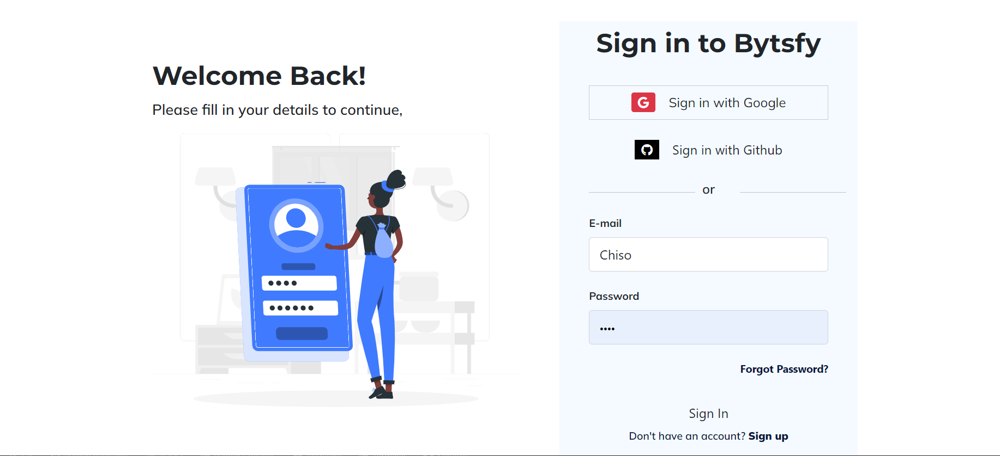
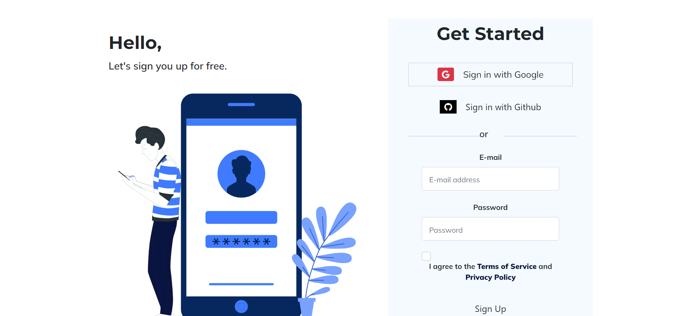
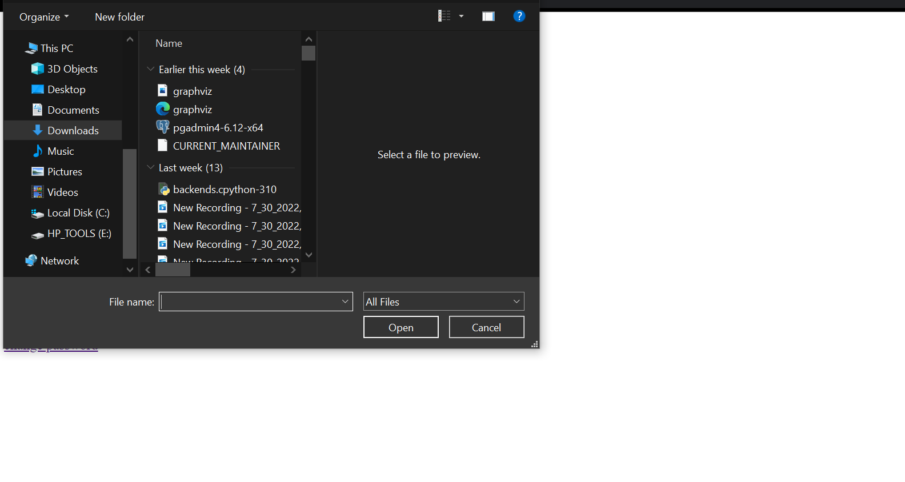

# bytsfile_team_46

 We are a team, tasked with the job of building a webapp that chunks big csv and json files on users specified size
<div align="center" style="list-style: none;">
<h1 >How does it work?</h1>
<ul style="text-align: center; list-style: none">

<li >Login </li>

<li>Or Signup on our website</li>

<li>Upload a file</li>

<li>Specify the chunk size</li>
<li>Specify Number of files</li>
<li>Click on the button</li>
<li>The file will be chunked and saved as .zip, ready for download</li>
</ul>
</div>


<h2>Or you want to run locally:</h2>

Clone the project

```
  git clone https://github.com/zuri-training/Chunk_file_team_46_Bytsfy
```

Go to the project directory

```

cd Chunk_file_team_46_Bytsfy

```

Create a Virtual Environment

```

python -m venv venv

```

Activate Virtual Environment

```

venv\scripts\activate

```

Install Dependencies

```

pip install -r requirements.txt

```

make migrations

```

python manage.py makemigrations

```

Migrate the database

```

python manage.py migrate

```

create superuser

```

python manage.py createsuperuser

```

 Start The Server.

```

python manage.py runserver

```
Login and Signup to the website

```

And if you have any suggestions on how to improve the project, please feel free to contact us or make a pull request on our github repository.

```

<h2>Built with:</h2>
<div style="align: center;">
  Python
  
  Django
  
  Bootstrap
  
   HTML5
  
</div>
